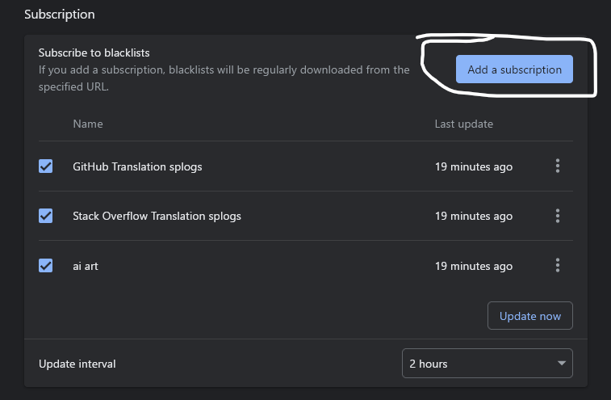
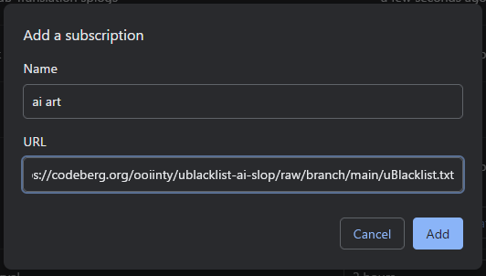
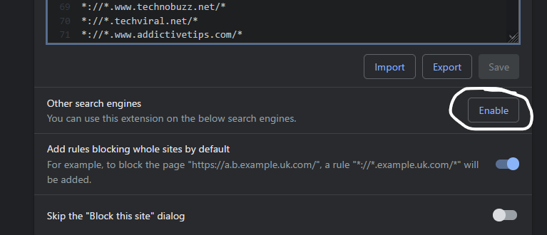
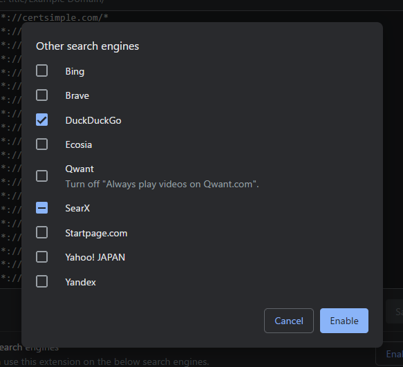

# ublacklist-ai-slop
Exclude AI image generators from web and image search results

## Usage

1. Install uBlacklist

- [Chrome Web Store](https://chrome.google.com/webstore/detail/ublacklist/pncfbmialoiaghdehhbnbhkkgmjanfhe)
- [Firefox Add-ons](https://addons.mozilla.org/en-US/firefox/addon/ublacklist/)

2. Open the uBlacklist configuration page, and then click "Add a subscription"

3. In the dialog that appears, copy and paste as follows, and then click "Add"

| Key  | Value                                                                                              |
| ---- | :------------------------------------------------------------------------------------------------- |
| Name | Filter that enables excluding the machine-translated sites of Stack Overflow                       |
| URL  | https://raw.githubusercontent.com/arosh/ublacklist-stackoverflow-translation/master/uBlacklist.txt |

4. If you use other search engines than Google, make sure to enable them in the options

